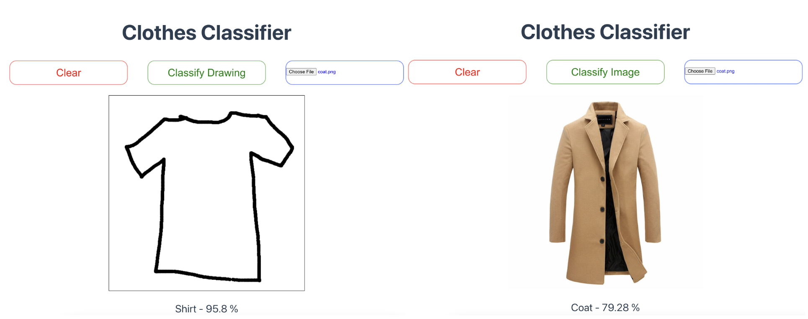
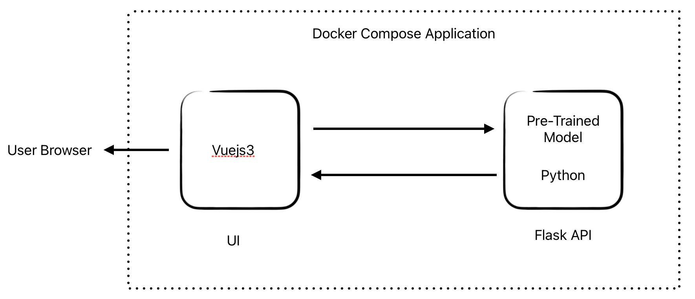

# MLP Neural Network - Classification


## Overview

This project is focused on the development and deployment of a MLP Neural Network for image classification using the [fashionmnist dataset](https://www.kaggle.com/datasets/zalando-research/fashionmnist). The development was done with the hand of the book [Neural Networks from Scratch in Python](https://nnfs.io/) and the deployment was done on a simple web UI developed in Vuejs on wich the user can upload an image or draw a picture to be classify. 

## Architecture
This UI is connected to a Flask server that loads the model and process the image returning the prediction and confidence for the prediction following the next architecture on docker.



## setup

clone this repository 

```sh
git clone https://github.com/Joancf1997/nnw_fashion_classification.git
cd nnw_fashion_classification
docker-compose up
```

Open the project UI at [Web UI](http://localhost:5173/)


